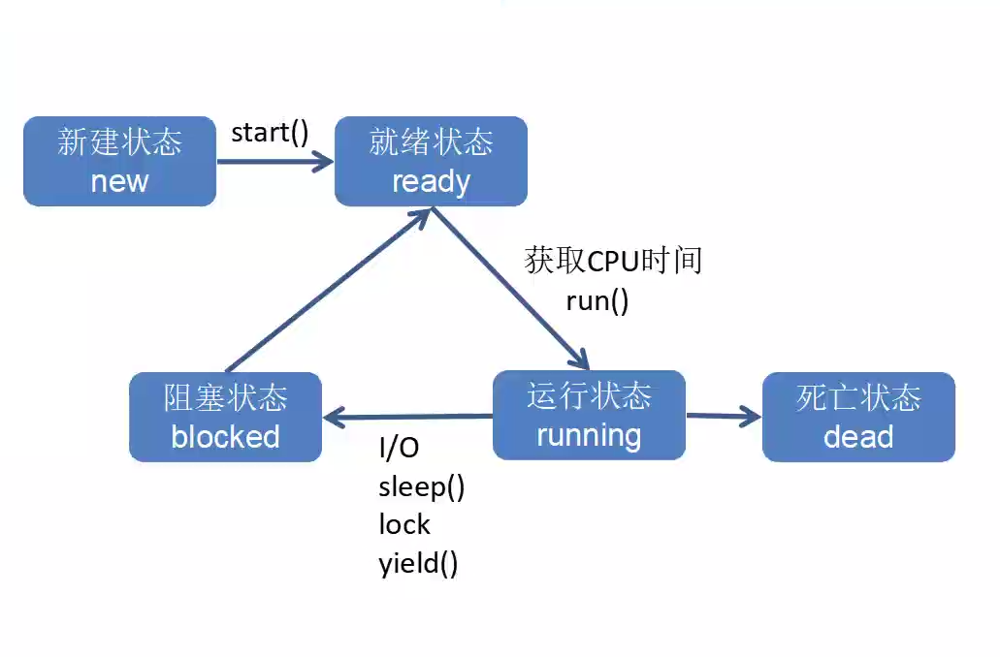
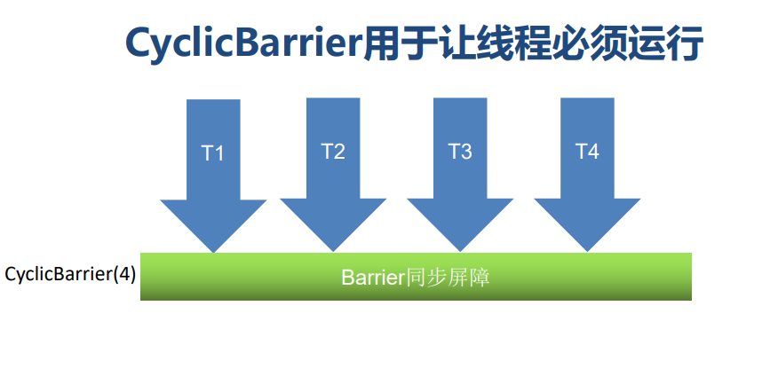
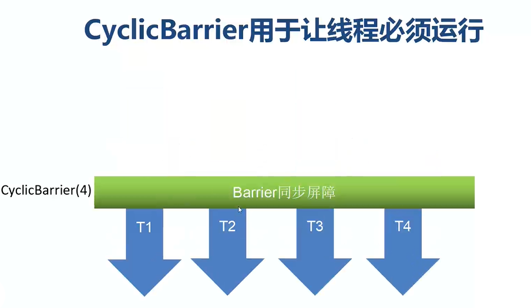
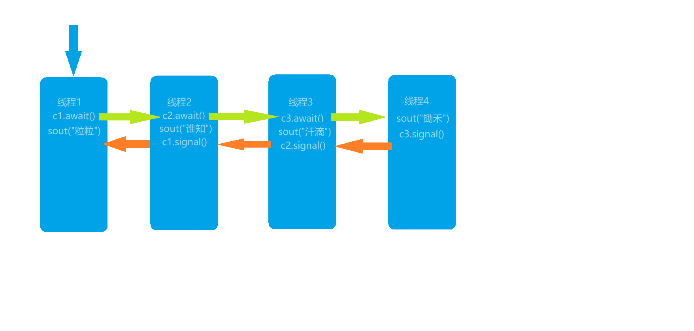
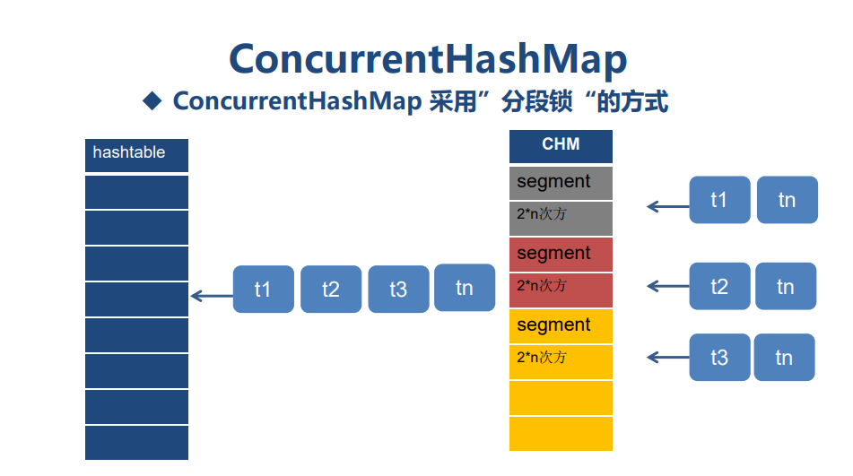

# JUC基本概念

## 一、程序、进程与线程

### 1.程序

* 程序是静态的概念，windows下通常指exe文件。

### 2.进程

* 进程是动态的概念，是程序在运行状态，进程说明程序在内存中的边界。

### 3.线程

* 线程是进程内的一个”基本任务”，每个线程都有自己的功能，是CPU分配与调度的基本单位

## 二、并发与并行

### 1.并发(concurrent)

* 单核CUP中的程序随时间片轮转的方式在不同的程序间交替执行

### 2.并行

* 多核CUP中存在并行执行的状态
* 多核中的存在单核，故同样存在并发

## 三、同步和异步

### 1.同步(synchronous)

* classic web application model：经典的网站应用遵循同步响应，一条请求再响应后才能继续下一条请求

### 2.异步(asynchronous)

* Ajax web applicaiton model：Ajax网站应用，通过Ajax Engine，将请求和响应接管。客户端请求无需经过服务器的响应，就可发起下一次请求

## 四、临界区

* 临界区用来表示一种公共资源与共享数据，可以被多个线程使用。 
* 同一时间只能有一个线程访问临界区（阻塞状态），其他资源必须等待。

## 五、死锁、饥饿、活锁

* 死锁：无可用资源，所以资源都被占用无法被释放，且占用资源的程序需要其他资源才能继续操作
* 饥饿：资源不足，需要等待
* 活锁：资源充足，但程序都在等待，无法继续操作

## 六、线程安全

### 1.概念

* 在拥有共享数据的多条线程并行执行的程序中，线程安全的代码会通过同步机制保证各个线程都可以正常且正确的执行，不会出现数据污染等意外情况。

### 2.线程安全三大特性

* **原子性** – 即一个操作或者多个操作 要么全部执行并且执行的过程不会被任何因素打断，要么就都不执行。i = i + 1
* **可见性** – 当多个线程访问同一个变量时，一个线程修改了这个变量的值，其他线程能够立即看得到修改的值。
* **有序性** – 如果在本线程内观察，所有的操作都是有序的；如果在一个线程观察另一个线程，所有的操作都是无序的。

# 线程创建

## 一、创建线程的三种方式

### 1.方式

1. 继承Thread类创建线程

2. 实现Runnable接口创建线程

3. 使用Callable和Future创建线程

### 2.并发工具包-Concurrent包

* JDK1.5以后为我们专门提供了一个并发工具包java.util.concurrent。
* java.util.concurrent 包含许多线程安全、测试良好、高性能的并发构建块。创建 concurrent 的目的就是要实现Collection框架对数据结构所执行的并发操作。通过提供一组可靠的、高性能并发构建块，开发人员可以提高并发类的线程安全、可伸缩性、性能、可读性和可靠性。

## 二、方式对比

|          | 继承Thread                       | 实现Runnable                                           | 利用线程池                   |
| -------- | -------------------------------- | ------------------------------------------------------ | ---------------------------- |
| 优点     | 编程简单，执行效率高             | 面向接口编程，执行效率高                               | 容器管理线程允许返回值与异常 |
| 缺点     | 单继承，无法对线程组进行有效控制 | 无法无法对线程组进行有效控制，没有返回值，没有异常提醒 | 执行效率相对低，编程麻烦     |
| 使用场景 | 不推荐使用                       | 简单的多线程程序                                       | 企业级应用推荐使用           |

## 三、线程的五大状态

1. 新建-new

2. 就绪-ready

3. 运行中-running

4. 阻塞-blocked

5. 死亡-dead

   

# 线程同步

## 一、代码中的同步机制

* synchronized（同步锁）关键字的作用就是利用一个特定的对象设置一个锁lock（绣球），在多线程（游客）并发访问的时候，同时只允许一个线程（游客）可以获得这个锁，执行特定的代码（迎娶新娘）。执行后释放锁，继续由其他线程争抢。

## 二、synchronized的使用场景

### 三种场景对应不同锁对象

1. synchronized代码块 - 任意对象即可
2. synchronized方法 - this当前对象
3. synchronized静态方法 - 该类的字节码对象

# 死锁

## 一、死锁产生的原因

* 死锁是在多线程情况下最严重的问题，在多线程对公共资源（文件、数据）等进行操作时，彼此不释放自己的资源，而去试图操作其他线程的资源，而形成交叉引用，就会产生死锁。
* ps：自己的理解：所以必须有同步锁(sychronized)时，才会产生死锁

## 二、解决死锁的根本

* 尽量减少公共资源的引用，用完马上释放
* 用完马上释放公共资源
* 减少synchronized使用，采用“副本”方式替代

# 线程安全

## 一、基本概念

* 在拥有共享数据的多条线程并行执行的程序中，线程安全的代码会通过同步机制保证各个线程都可以正常且正确的执行，不会出现数据污染等意外情况。

## 二、线程安全与线程不安全

### 1.线程安全

* 优点：可靠
* 缺点：执行速度慢
* 使用建议：需要线程共享时使用

### 2.线程不安全

* 优点：速度快
* 缺点：可能与预期不符
* 使用建议：在线程内部使用，无需线程间共享

## 三、常用线程类

| 线程安全                 | 线程不安全                          |
| ------------------------ | ----------------------------------- |
| Vector是线程安全的       | ArrayList、LinkedList是线程不安全的 |
| Properties是线程安全的   | HashSet、TreeSet是不安全的          |
| StringBuffer是线程安全的 | StringBuilder是线程不安全的         |
| HashTable是线程安全的    | HashMap是线程不安全的               |

# 线程池

## 一、线程创建方式再对比

| 分类       | 特性                                                         |
| ---------- | ------------------------------------------------------------ |
| newThread  | new Thread()新建对象，性能差                                 |
|            | 线程缺乏统一管理，可能无限制的新建线程，相互竞争，严重时会占用过多系统资源导致死机或OOM |
| ThreadPool | 重用存在的线程，减少对象对象、消亡的开销                     |
|            | 线程总数可控，提高资源的利用率                               |
|            | 避免过多资源竞争，避免阻塞                                   |
|            | 提供额外功能，定时执行、定期执行、监控等                     |

## 二、线程池种类

### 1.工具类Executors

* 在java.util.concurrent中，提供了工具类Executors（调度器）对象来创建线程池，可创建的线程池有四种

| 分类                           | 说明                             | 特点                                                         |
| ------------------------------ | -------------------------------- | ------------------------------------------------------------ |
| CachedThreadPool-可缓存线程池  | 创建一个可缓存的线程池           | 无限大，线程池中没有空闲线程直接创建，有空闲的才去利用       |
| FixedThreadPool-定长线程池     | 创建一个定长线程池               | 固定线程数，空闲线程用于执行任务，若所有线程都在使用，后续任务处于等待状态 |
| SingleThreadExecutor-单线程池  | 创建一个只有一个线程的定长线程池 | 一般作为守护线程                                             |
| ScheduledThreadPool-调度线程池 | 创建一个可调度的线程池           | 不仅可以置顶固定线程数，还可以通过方法设定延时执行、周期执行的间隔时间 |

### 2.注意事项

1. 线程池需要关闭

   * shutdown()等待线程完成后关闭
   * shutdownNow()立即关闭，不等待线程

2. ExecutorService用于管理线程，即包含线程池

   * 一般的：

   * ```java
     ExecutorService threadPool = Executors.newCachedThreadPool();
     for (int i = 0; i < 1000; i++) {
         final int index = i;
         threadPool.execute(new Runnable() {
             @Override
             public void run() {
                 System.out.println(Thread.currentThread().getName() + ":" + index);
             }
         });
     }
     threadPool.shutdown();
     ```

3. FixedThreadPool中的备选等待算法默认为FIFO(先进先出)，可更换为LIFO(后进先出)。

4. ScheduledThreadPool语法特殊

   * ```java
     ScheduledExecutorService scheduledPool = Executors.newScheduledThreadPool(5);// 可调度线程数
     scheduledPool.scheduleAtFixedRate(new Runnable() {
         @Override
         public void run() {
             System.out.println(new Date() + "延时一秒之前，每三秒执行一次");
         }
     }, 1, 3, TimeUnit.SECONDS);
     ```

   * ```java
     scheduledPool.schedule(Runnable, long, TimeUnit);
     scheduledPool.schedule(Callable<v>, long, TimeUnit);
     // 传入一个线程，一个延时时间， 一个时间单位
     scheduledPool.scheduleAtFixedRate(Runnable, long, long, TimeUnit);
     // 传入一个线程，一个延时时间，一个循环周期隔的时间，一个时间单位
     ```

   * ```java
     public ScheduledFuture<?> schedule(Runnable command, long delay, TimeUnit unit);
     public <V> ScheduledFuture<V> schedule(Callable<V> callable, long delay, TimeUnit unit);
     public ScheduledFuture<?> scheduleAtFixedRate(Runnable command, long initialDelay, long period, TimeUnit unit);
     ```

5. 其实java.util.Timer和scheduleAtFixedRate在实际开发中都不会用到。

   * 常常是采用成套的成熟框架，如：调度框架Quartz，或者Spring自带调度。
   * 框架大都支持表达式Cron表达式。

## 三、线程池经典应用

1. 数据库连接池
2. Tomcat多线程实现
3. MQ消息队列线程池

# 倒计时锁

## 一、CountDownLatch(倒计时锁)

* CountDownLatch倒计时锁特别适合”总-分任务”，例如多线程计算后的数据汇总
* CountDownLatch类位于java.util.concurrent（J.U.C）包下，利用它可以实现类似计数器的功能。比如有一个任务A，它要等待其他3个任务执行完毕之后才能执行，此时就可以利用CountDownLatch来实现这种功能了。

## 二、代码示例

```java
package com.itlaoqi.juc;

import java.util.concurrent.CountDownLatch;
import java.util.concurrent.ExecutorService;
import java.util.concurrent.Executors;

public class CountDownSample {
    private static int count = 0;
    public static void main(String[] args) {
        ExecutorService threadPool = Executors.newFixedThreadPool(100);
        CountDownLatch cdl = new CountDownLatch(10000); //CDL总数和操作数保持一致
        for(int i = 1 ; i <= 10000 ; i++) {
            final int index = i;
            threadPool.execute(new Runnable() {
                @Override
                public void run() {
                    synchronized (CountDownSample.class) {
                        try {
                            count = count + index;
                            //计数器减一
                        }catch(Exception e){
                            e.printStackTrace();
                        }finally {
                            cdl.countDown();
                        }
                    }
                }
            });
        }
/*        try {
            Thread.sleep(1000);
        } catch (InterruptedException e) {
            e.printStackTrace();
        }*/
        try {
            cdl.await(); //堵塞当前线程，知道cdl=0的时候再继续往下走
            //为了避免程序一致挂起，我们可以设置一个timeout时间
        } catch (InterruptedException e) {
            e.printStackTrace();
        }
        System.out.println(count);
        threadPool.shutdown();
    }
}
```

# Semaphore信号量

## 一、Semaphore的作用

* Semaphore信号量经常用于限制获取某种资源的线程数量。下面举个例子，比如说操场上有5个跑道，一个跑道一次只能有一个学生在上面跑步，一旦所有跑道在使用，那么后面的学生就需要等待，直到有一个学生不跑了。

## 二、代码示例

* semaphore.acquire();

  * 获取一个信号量，因为信号量不一定有空闲，会获取失败，故需要try-catch。
  * 获取后需要进行“想限制的操作”。操作过后需要释放信号量-semaphore.release();

  ```java
  ExecutorService threadPool = Executors.newCachedThreadPool();
  Semaphore semaphore = new Semaphore(5);//定义5个信号量，也就是说服务器只允许5个人在里面玩
  for(int i = 1 ; i <= 20 ; i++) {
      final int index = i;
      threadPool.execute(new Runnable() {
          @Override
          public void run() {
              try {
                  semaphore.acquire();//获取一个信号量，“占用一个跑道”
                  play();
                  semaphore.release();//执行完成后释放这个信号量，“从跑道出去”
              } catch (InterruptedException e) {
                  e.printStackTrace();
              }
          }
      });
  }
  threadPool.shutdown();
  ```

  ```java
  public static void play(){
      try {
          System.out.println(new Date() + " " + Thread.currentThread().getName() + ":获得紫禁之巅服务器进入资格");
          Thread.sleep(2000);
          System.out.println(new Date() + " " + Thread.currentThread().getName() + ":退出服务器");
          Thread.sleep(500);
      } catch (InterruptedException e) {
          e.printStackTrace();
      }
  }
  ```

* semaphore.tryAcquire(6, TimeUnit.SECONDS);

  * 尝试获取一个信号量。如果成功就返回true，失败后返回false。
  * 所以不需要使用try-catch。

  ```java
  ExecutorService threadPool = Executors.newCachedThreadPool();
  Semaphore semaphore = new Semaphore(5);//定义5个信号量，也就是说服务器只允许5个人在里面玩
  for(int i = 1 ; i <= 20 ; i++) {
      final int index = i;
      threadPool.execute(new Runnable() {
          @Override
          public void run() {
              try {
                  //尝试获取一次信号量，5秒钟内获取到返回true，否则返回false
                  if(semaphore.tryAcquire(6, TimeUnit.SECONDS)) {
                      play();
                      semaphore.release();//执行完成后释放这个信号量，“从跑道出去”
                  }else{
                      System.out.println(Thread.currentThread().getName() + ":对不起，服务器已满，请稍后再试");
                  }
              } catch (InterruptedException e) {
                  e.printStackTrace();
              }
          }
      });
  }
  threadPool.shutdown();
  ```

# CyclicBarrier循环屏障

## 一、概述

* CyclicBarrier是一个同步工具类，它允许一组线程互相等待，直到到达某个公共屏障点。与CountDownLatch不同的是该barrier在释放等待线程后可以重用，所以称它为循环（Cyclic）的屏障（Barrier）。
* 
* 
* 经典应用场景
  * 多线程跑分软件
  * 茅台酒秒杀，固定名额
  * 携程抢票

## 二、代码示例

```java
package com.itlaoqi.juc;

import java.util.concurrent.BrokenBarrierException;
import java.util.concurrent.CyclicBarrier;
import java.util.concurrent.ExecutorService;
import java.util.concurrent.Executors;

public class CyclicBarrierSample {
    // 类似与守护线程
    private static CyclicBarrier cyclicBarrier = new CyclicBarrier(5);
    
    public static void main(String[] args) {
        ExecutorService executorService = Executors.newCachedThreadPool();
        for(int i = 1 ; i<=20 ; i++) {
            final int index = i;
            try {
                Thread.sleep(1000);
            } catch (InterruptedException e) {
                e.printStackTrace();
            }
            executorService.execute(new Runnable() {
                @Override
                public void run() {
                    go();
                }
            });
        }
        executorService.shutdown();
    }
    
    private static void go(){
        System.out.println(Thread.currentThread().getName() + ":准备就绪" );
        try {
            cyclicBarrier.await();//设置屏障点，当累计5个线程都准备好后，才运行后面的代码
            System.out.println(Thread.currentThread().getName() + ":开始运行");
        } catch (InterruptedException e) {
            e.printStackTrace();
        } catch (BrokenBarrierException e) {
            e.printStackTrace();
        }
    }
}
```

# ReentrantLock重入锁

## 一、概述

* 重入锁是指任意线程在获取到锁之后,再次获取该锁而不会被该锁所阻塞
* ReentrantLock设计的目标是用来替代synchronized关键字
* 但是由于性能、使用复杂度等原因。**不推荐**使用

## 二、与synchronized的比较

| 特征     | synchronized(推荐)   | ReentrantLock                                       |
| -------- | -------------------- | --------------------------------------------------- |
| 底层原理 | JVM实现              | JDK实现                                             |
| 性能区别 | 低->高（JDK5+)       | 高                                                  |
| 锁的释放 | 自动释放(编译器保证) | 手动释放(finally保证)                               |
| 编码程度 | 简单                 | 复杂                                                |
| 锁的粒度 | 读写不区分           | 读锁、写锁(用于区分读入和写入)                      |
| 高级功能 | 无                   | 公平锁、非公平锁唤醒；Condition分组唤醒；中断等待锁 |

# Condition条件唤醒

## 一、概述

* 我们在并行程序中，避免不了某些线程要预先规定好的顺序执行，例如：先新增再修改,先买后卖，先进后出......，对于这类场景，使用JUC的Condition对象再合适不过了。
* JUC中提供了Condition对象，用于让指定线程等待与唤醒，按预期顺序执行。它必须和ReentrantLock重入锁配合使用。
* Condition用于替代wait()/notify()方法。notify只能随机唤醒等待的线程，而Condition可以唤醒指定的线程，这有利于更好的控制并发程序。

## 二、Condition核心方法

* await() - 阻塞当前线程，直到singal唤醒
* signal() - 唤醒被await的线程，从中断处继续执行
* signalAll() - 唤醒所有被await()阻塞的线程

## 三、代码示例

### 1.执行过程



### 2.代码

``` java
package com.itlaoqi.juc;

import java.util.concurrent.locks.Condition;
import java.util.concurrent.locks.ReentrantLock;

public class ConditionSample {
    public static void main(String[] args) {
        // Condition必须和ReentrantLock搭配使用
        ReentrantLock lock = new ReentrantLock();
        Condition c1 = lock.newCondition();
        Condition c2 = lock.newCondition();
        Condition c3 = lock.newCondition();

        // Thread-1
        new Thread() {
            @Override
            public void run() {
                // 加锁操作
                lock.lock();
                try {
                    // 阻塞当前线程，当c1.signal()时，线程激活继续执行
                    c1.await();
                    Thread.sleep(1000);
                    System.out.println("粒粒皆辛苦");
                } catch (InterruptedException e) {
                    e.printStackTrace();
                } finally {
                    // 解锁操作
                    lock.unlock();
                }
            }
        }.start();

        // Thread-2
        new Thread() {
            @Override
            public void run() {
                // 加锁操作
                lock.lock();
                try {
                    // 阻塞当前线程，当c2.signal()时，线程激活继续执行
                    c2.await();
                    Thread.sleep(1000);
                    System.out.println("谁知盘中餐");
                    c1.signal();
                } catch (InterruptedException e) {
                    e.printStackTrace();
                } finally {
                    // 解锁操作
                    lock.unlock();
                }
            }
        }.start();

        // Thread-3
        new Thread() {
            @Override
            public void run() {
                // 加锁操作
                lock.lock();
                try {
                    // 阻塞当前线程，当c3.signal()时，线程激活继续执行
                    c3.await();
                    Thread.sleep(1000);
                    System.out.println("汗滴禾下土");
                    c2.signal();
                } catch (InterruptedException e) {
                    e.printStackTrace();
                } finally {
                    // 解锁操作
                    lock.unlock();
                }
            }
        }.start();

        // Thread-4
        new Thread() {
            @Override
            public void run() {
                // 加锁操作
                lock.lock();
                try {
                    Thread.sleep(1000);
                    System.out.println("锄禾日当午");
                    // T3线程唤醒
                    c3.signal();
                } catch (InterruptedException e) {
                    e.printStackTrace();
                } finally {
                    // 解锁操作
                    lock.unlock();
                }
            }
        }.start();
    }
}
```

# Callable&Future

## 一、概述

* **Callable**和Runnable一样代表着任务，区别在于Callable有**返回值**并且可以抛出异常。
* **Future**是一个接口。
  * 它用于表示异步计算的结果。
  * 提供了检查计算是否完成的方法，以等待计算的完成，并获取计算的结果。
  * 有点像守护线程，检测着线程完成，并接收结果。

## 二、代码示例

```java
package com.itlaoqi.juc;

import com.sun.org.apache.xpath.internal.operations.Bool;

import java.util.concurrent.*;

public class FutureSample {
    public static void main(String[] args) {
        ExecutorService executorService = Executors.newFixedThreadPool(10);
        for(int i = 2 ; i <= 10000 ; i++){
            Computor c = new Computor();
            c.setNum(i);
            //Future是对用于计算的线程进行监听，因为计算是在其他线程中执行的，所以这个返回结果的过程是异步的
            Future<Boolean> result = executorService.submit(c);//将c对象提交给线程池，如有空闲线程立即执行里面的call方法
            try {
                Boolean r = result.get(); //用于获取返回值，如果线程内部的call没有执行完成，则进入等待状态，直到计算完成
                if(r == true){
                    System.out.println(c.getNum());
                }
            } catch (InterruptedException e) {
                e.printStackTrace();
            } catch (ExecutionException e) {
                e.printStackTrace();
            }
        }
        executorService.shutdown();
    }
}
// 可以多线程(实现Callable接口)执行的内部类
class Computor implements Callable<Boolean>{
    private Integer num;

    public Integer getNum() {
        return num;
    }

    public void setNum(Integer num) {
        this.num = num;
    }
    // 测试算法--是否为质数
    @Override
    public Boolean call() throws Exception {
        boolean isprime = true;
        for(int i = 2 ; i < num ; i++) {
            if (num % i == 0) {
                isprime = false;
                break;
            }
        }
        return isprime;
    }
}
```

# 并发容器

## ArrayList

* CopyOnWriteArrayList - 写复制列表
  * 为了保护线程安全，先将目标List进行拷贝-Copy，再将操作在新复制的List中进行操作
  * 提供新思路，多线程中，想要保护一个资源的线程安全，除了加锁让所以线程依次进行操作外(效率慢)，还可以所以线程进行拷贝，之后慢慢操作拷贝资源(效率高)。

## HashSet

* CopyOnWriteArraySet - 写复制集合
  * 同上

## HashMap

* ConcurrentHashMap- 分段锁映射
  * 关键是**分段锁**思想
  * 

# Atomic包

* 原子性：是指一个操作或多个操作要么全部执行，且执行的过程不会被任何因素打断，要么就都不执行。
* Atomic包是java.util.concurrent下的另一个专门为线程安全设计的Java包，包含多个原子操作类。
* Atomic常用类：可以使用这些类完成线程安全操作
  * AtomicInteger
  * AtomicIntegerArray
  * AtomicBoolean
  * AtomicLong
  * AtomicLongArray

# CAS算法

## 一、悲观锁和乐观锁

1. 锁是用来做并发最简单的方式，当然其代价也是最高的。独占锁是一种**悲观锁**，**synchronized**就是一种独占锁，它假设最坏的情况，并且只有在确保其它线程不会造成干扰的情况下执行，会导致其它所有需要锁的线程挂起，等待持有锁的线程释放锁。
2. 所谓**乐观锁**就是，每次不加锁而是假设没有冲突而去完成某项操作，如果因为冲突失败就重试，直到成功为止。其中**CAS**（比较与交换，Compare AndSwap）是一种有名的无锁算法。

## 二、应用场景

* 虽然基于CAS的线程安全机制很好很高效，但要说的是，并非所有线程安全都可以用这样的方法来实现，这只适合一些粒度比较小型,如计数器这样的需求用起来才有效，否则也不会有锁的存在了。
