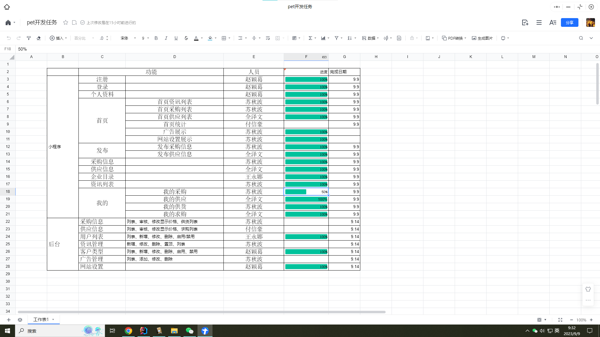

# 第一周

## 9.01 周五 晴

### TODO：

1. 设计模式回顾

## 9.02 周六 阴

### TODO：

1. 算法书chapter1

# 第二周

## 9.04 周一 晴

### TODO：

1. 新项目开始，pet盛唐化纤
1. 完成页面初始化

## 9.05 周二 多云

### TODO：

1. 完成api编写：资讯、网站设置、广告管理
2. api编写：合同模板

## 9.06 周三 晴

### TODO：

1. 分页新增isLastPage。
2. 首页资讯管理新接口。

### 收获：

1. 分页PageHelper。

### 问题：

1. 审核过后再展示？
2. 排序问题

## 9.07 周四 晴

### TODO：

1. 解决发布人问题
1. 完成api编写：采购信息

## 9.08 周五 晴

### TODO：

1. 完成api编写：我要供货，供货列表
1. 完成api所有的编写

## 9.09 周六 晴

### TODO：

1. 算法书
2. 后台编写
3. 

# 第三周

## 9.11 周一 晴转小雨

### TODO：

1. 完成资讯管理页面

### 问题：

1. 置顶操作没有更新时间和更新人
   * 可以写在sql中

## 9.12 周二 小雨

### TODO：

1. 开始编写采购信息

## 9.13 周三 阴转多云

### TODO：

1. 开始编写采购-供应信息

## 9.14 周四 晴

### TODO：

1. 路由跳转

## 9.15 周五 晴

### TODO：

1. 完善pet小程序细节

## 9.16 周六 晴

### TODO：

1. 查看高德GIS接口
2. 加班21:30，帮助前端上线
   * API-文件上传修复-v0.1
   * API-采购信息修复新增produreName-v0.1
   * API-keyWord模糊查询-v0.1
   * API-供应信息详情新增dictName-v0.1

### 收获：

1. keyWord模糊查询接口
2. 链表获取他表字段

# 第四周

## 9.18 周一 多云

### TODO：

1. 后台-资讯类型管理
2. 后台-资讯信息升级
3. API-我的供应修复验货单

## 9.19 周二 中雨

### TODO：

1. 后台-网站设置新增收款、会员说明
2. API-收款接口、说明接口
3. 后台-成为会员
4. API-成为会员
5. API-资讯信息升级

## 9.20 周三 晴

### TODO：

1. 后台-网站设置推广说明
2. API-获取推广用户列表
3. API-推广注册

## 9.21 周四 阴（好冷）

### TODO：

1. 后台-推广用户列表

## 9.22 周五 晴

### TODO：

1. 坐高铁找猪🐖
2. 后台-采购、供应腾讯GIS

## 9.25 周一 小雨

### TODO：

1. PET小程序bug修复

### 收获：

1. sql日期函数：

   * ```sql
     update t_infor set is_delete = unix_timestamp(now()) where id = #{id}
     ```

## 9.26 周二 小雨转阴

### TODO：

1. PET小程序bug修复

## 9.27 周三 晴

### TODO：

1. pet台儿庄需求对接
1. PET小程序bug修复

## 9.28 周四

### TODO：

1. 经纬度校验
2. 用户信息新增地图选点
