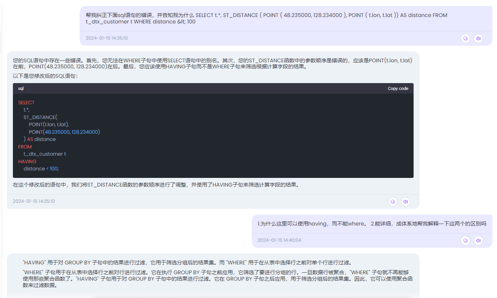

# 第一周

## 1.02 周二 晴

### TODO：

1. 打天下用户管理
1. 财金贷款申请

## 1.03 周三 晴

### TODO：

1. 财金台账修改

## 1.04 周四 阴

### TODO：

1. 新物流打天下用户管理

## 1.05 周五 晴

### TODO：

1. 打天下拜访记录

## 1.06 周六 晴

### TODO：

1. 打天下拜访记录

# 第二周

## 1.08 周一 晴

### TODO：

1. 打天下成交记录
1. 财金系统部署

## 1.09 周二 阴

### TODO：

1. 打天下成交记录
1. 打天下达标记录

## 1.10 周三 晴

### TODO：

1. 打天下达标记录

## 1.11 周四 晴

### TODO：

1. 打天下达标记录
1. 财金系统，动态显示金额

## 1.12 周五 晴

### TODO：

1. 财金系统，新增还款日期

## 1.13 周六 大雾

### TODO：

1. 财金系统部署

# 第三周

## 1.15 周一 晴

### TODO：

1. 客户详情

2. 周边客户

   

## 11.16 周二 大雪转阴

### TODO：

1. 周边客户
1. API-定时任务

## 11.17 周三 小雨

### TODO：

1. API-定时任务

## 11.18 周四 阴

### TODO：

1. API-定时任务
1. rocketMQ-p5

## 11.19 周五 阴

## TODO：

1. API-定时任务

## 11.20 周六 阴

### TODO：

1. 函数式编程Lambda-p13
1. 年会

## 11.21 周天 晴

### TODO：

1. 爬天蒙山，倒赔80元缆车下山

# 第四周

## 11.22 周一 晴

### TODO：

1. 函数式编程

## 11.23 周二 晴

### TODO：

1. 函数式编程-p19

## 11.24 周三 晴

### TODO：

1. 函数式编程Lambda-p26

## 11.25 周四 晴

### TODO：

1. idea快捷键：
   * ctrl + p 、ctrl + q：方法明细，方法参数明细
   * ctrl + alt + ←：定位上次到光标位置
2. 函数式编程Lambda-p47

## 11.26 周五 晴

### TODO：

1. 函数式编程done
1. 函数式编程笔记-p21

## 11.27 周六  晴

### TODO：

1. 函数式编程笔记-p40

# 第五周

## 11.29 周一 阴

