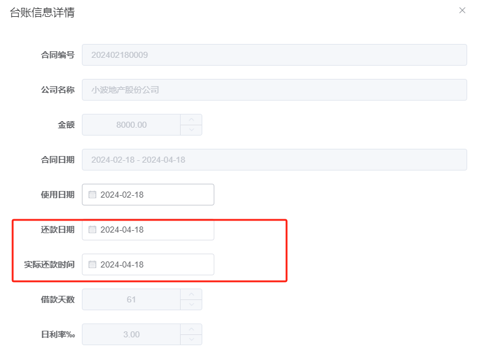
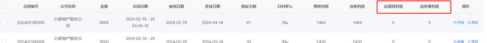

# 第一周

## 2.01 周四 小雪转多云

### TODO：

1. 回看笔记-设计模式

## 2.02 周五 阴

### TODO：

1. 回看笔记-设计模式

## 2.03 周六 小雪转阴

### TODO：

1. 新物流收尾

## 2.04 周天 阴转中雪

### TODO：

1. 新物流收尾

# 第二周

## 2.05 周一 多云

### TODO：

1. 新物流收尾

### 问题：

1. 下班被追尾

# 第三周

## 2.18 周天 阴

### TODO：

1. 送猪猪坐高铁
2. 财金系统需求修改

### 问题：

1. 还款日期改为实际还款日期

   > 本来存在**还款日期**和**实际还款日期**，这里需要展示**实际还款日期**吗？

   

2. 删除应退利息。应补缴改下名 应退或补缴利息

   > 这里是需要改成①**应退**、②**补缴利息**、③**应退或补缴利息**。哪个序号？
   >
   > 如果改成序号③，是否要将原本的**应退回利息**和**应补缴利息**合并？

   

## 2.19 周一 大风

### TODO：

1. 财金系统需求修改

## 2.20 周二 阴转小雪

### TODO：

1. 新年计划会议

## 2.21 周三 大雪

### TODO：

1. Spring Cloud Nacos v2
2. 威圣小程序立项

## 2.22 周四 多云

### TODO：

1. 威圣小程序开始

## 2.23 周五 晴

### TODO：

1. 威圣小程序公告文章

## 2.24 周六 多云

## TODO：

1. 威圣小程序用户管理：用户信息、积分信息

# 第四周

## 2.26 周一 阴

### TODO：

1. 威圣小程序用户管理：等级

## 2.27 周二 晴

### TODO：

1. 威圣小程序用户管理：等级

## 2.28 周三 多云

### TODO：

1. mybatisPlus P19
2. 威圣小程序首页：轮播图

## 2.29 周四 雨夹雪

### TODO：

1. mybatisPlus 结束
1. 威圣小程序用户管理：等级
