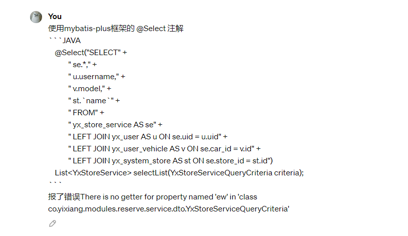

# 第一周

## 3.01 周五 晴

### TODO：

1. 威圣小程序用户管理：车辆信息

## 3.02 周六 晴

### TODO：

1. 威圣小程序用户管理：车辆信息接口文档

# 第二周

## 3.04 周一 阴

### TODO：

1. 威圣小程序多页面细节调整

## 3.05 周二 小雨

### TODO：

1. Spring Cloud Alibaba

## 3.06 周三 多云

### TODO：

1. Spring Cloud Alibaba 

## 3.07 周四 多云

### TODO：

1. API-活动文章

## 3.08 周五 晴

### TODO：

1. API-为首页Banner获取文章

# 第三周

## 3.11 周一 晴

### TODO：

1. Spring Cloud Alibaba P9
1. API-user信息会员等级信息

## 3.12 周二 晴 

### TODO：

1. 后台-预约服务

## 3.13 周三 晴

### TODO：

1. 后台-预约服务

### 问题：



这个错误通常是因为MyBatis-Plus框架的动态SQL在解析SQL语句时，默认会检查查询方法的参数是否为Wrapper类型（比如QueryWrapper、UpdateWrapper等）。在你的方法中，`@Select`注解的SQL语句里并没有使用到Wrapper，但是MyBatis-Plus仍然尝试检查`YxStoreServiceQueryCriteria`类中是否有名为'ew'的属性，因为它是QueryWrapper的默认别名。

为了解决这个问题，你可以尝试以下几种方法：

1. **在方法中添加@Param注解：** 在方法的参数前面添加`@Param`注解，明确指定参数的名称，而不是依赖默认的参数名。

   ```java
   List<YxStoreService> selectList(@Param("criteria") YxStoreServiceQueryCriteria criteria);	
   ```

   然后在SQL语句中使用`#{criteria.xxx}`来引用参数。

2. **使用Provider来构建动态SQL：** 使用MyBatis的Provider功能，通过Java代码来动态构建SQL语句。这样可以更加灵活地构建SQL，避免了对参数名称的依赖。

   首先创建一个Provider类，定义方法来生成SQL语句：

   ```java
   import org.apache.ibatis.annotations.SelectProvider;
   
   public class YxStoreServiceProvider {
       public String selectListSql() {
           return "SELECT" +
               " se.*," +
               " u.username," +
               " v.model," +
               " st.`name`" +
               " FROM" +
               " yx_store_service AS se" +
               " LEFT JOIN yx_user AS u ON se.uid = u.uid" +
               " LEFT JOIN yx_user_vehicle AS v ON se.car_id = v.id" +
               " LEFT JOIN yx_system_store AS st ON se.store_id = st.id";
       }
   }
   ```

   然后在Mapper接口中使用`@SelectProvider`注解指定Provider类和方法：

   ```java
   import org.apache.ibatis.annotations.SelectProvider;
   
   public interface YxStoreServiceMapper {
       @SelectProvider(type = YxStoreServiceProvider.class, method = "selectListSql")
       List<YxStoreService> selectList(YxStoreServiceQueryCriteria criteria);
   }
   ```

   这样就可以在Provider类中灵活地构建SQL语句，而不需要依赖参数名。

## 3.14 周四 晴

### TODO：

1. 后台-预约服务

## 3.15 周五 晴

### TODO：

1. 后台-预约服务更新车辆信息

## 3.16 周六 阴

### TODO：

1. 威圣验收
